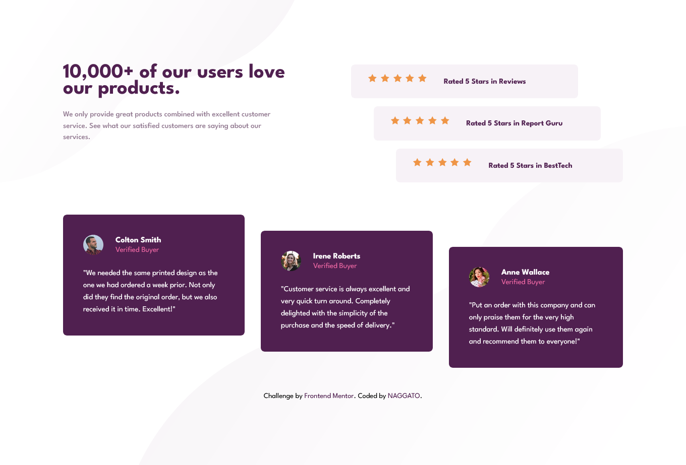

# Frontend Mentor - Social proof section solution

This is a solution to the [Social proof section challenge on Frontend Mentor](https://www.frontendmentor.io/challenges/social-proof-section-6e0qTv_bA). Frontend Mentor challenges help you improve your coding skills by building realistic projects. 

## Table of contents

- [Overview](#overview)
  - [The challenge](#the-challenge)
  - [Screenshot](#screenshot)
  - [Links](#links)
- [My process](#my-process)
  - [Built with](#built-with)
  - [What I learned](#what-i-learned)
- [Author](#author)
- [Acknowledgments](#acknowledgments)

## Overview

### The challenge

Users should be able to:

- View the ideal layout for the section depending on the device screen size (Full Responsiveness).
- View hover states and interactions in an accessible way.

### Screenshot



### Links

- Solution URL: [https://github.com/eneasdutra/social-proof-section](https://github.com/eneasdutra/social-proof-section)
- Live Site URL: [https://eneasdutra.github.io/social-proof-section/](https://eneasdutra.github.io/social-proof-section/)

## My process

### Built with

- **Semantic HTML5**: Use of tags such as `main`, `article`, and `blockquote` for better SEO and accessibility.
- **CSS Custom Properties**: Use of variables for HSL colors and easy maintenance.
- **Flexbox & CSS Grid**: Combination of the two techniques for complex staircase layouts.
- **Mobile-first workflow**: Ensuring performance on mobile devices before expanding to desktop.

### What I learned

In this project, I focused on aligning elements asymmetrically using `align-self` in Flexbox and negative margins to create the "staircase" effect of the cards, while keeping the code clean.

```css
/* Exemplo de como fiz o escalonamento dos cards */
.rating-card[data-offset="2"] { 
  align-self: center; 
  }
```
## Author

- Frontend Mentor - [@eneasdutra](https://www.frontendmentor.io/profile/eneasdutra)
- Linkedin - [@eneasmdutra](https://www.linkedin.com/in/eneasmdutra)
- Github - [@eneasdutra](https://github.com/eneasdutra)

## Acknowledgments

I thank the Frontend Mentor team for providing such inspiring designs for practice.
